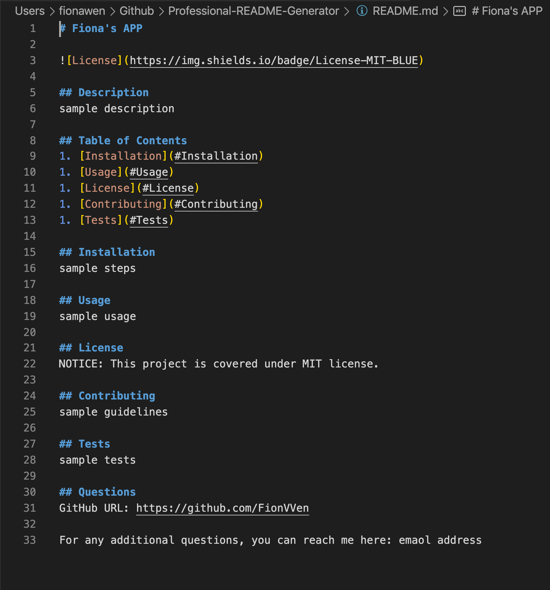

# Professional-README-Generator

## Description 

Quickly create a professional README file by using a command-line application (i.e. Terminal, Git Bash, etc.) to generate one. Project creators can devote more time to working on the project and less time on creating a README.
The application uses the inquirer package, and will be invoked by using the following command:
node index.js

Repository URL: https://github.com/FionVVen/Professional-README-Generator/

## Walkthrough Video

The following video demonstrates the application's functionality:

The following image demonstrates the final appearance of the sample README file:

